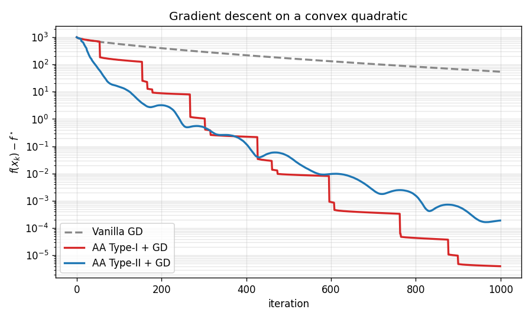

# aa — Anderson Acceleration

[](https://github.com/cvxgrp/aa/actions/workflows/build.yml)
[](https://github.com/cvxgrp/aa/actions/workflows/valgrind.yml)

A small C library (with Python bindings) that accelerates fixed-point
iterations `x ← F(x)` using **Anderson Acceleration** — Type-I or Type-II,
with optional relaxation and a built-in safeguarding step. Useful whenever
you have a contraction or nonexpansive map — gradient descent, proximal
algorithms, operator-splitting solvers (ADMM / PDHG), fixed-point
optimization — and want to converge in fewer iterations without changing
the underlying map.

The algorithm and its theoretical guarantees are described in
[Globally Convergent Type-I Anderson Acceleration for Non-Smooth Fixed-Point
Iterations](https://web.stanford.edu/~boyd/papers/nonexp_global_aa1.html).
The MATLAB code used for the experiments in that paper lives at
[cvxgrp/nonexp_global_aa1](https://github.com/cvxgrp/nonexp_global_aa1/).

## How it works

At every iteration the library looks back at the last `mem` iterates and
solves a small least-squares problem to pick a linear combination that
should drive `x − F(x)` toward zero faster than plain `x ← F(x)`. You keep
calling your own map `F`; AA only decides what point to feed it next. A
built-in safeguard rejects AA steps that don't make progress, falling back
to the underlying iteration so convergence is preserved even when AA
misbehaves.

The standard usage pattern is:

```
for i = 0, 1, 2, ...
    if i > 0: aa_apply(x, x_prev)    # replaces x with AA extrapolate
    x_prev = x
    x = F(x)                         # your map — unchanged
    aa_safeguard(x, x_prev)          # accept or roll back
```

## Install

### Python

```bash
pip install anderson-acceleration
```

The wheel bundles an optimized BLAS/LAPACK (Apple's Accelerate on macOS,
OpenBLAS on Linux and Windows), so you don't need a system BLAS installed.

### C, from source

Requires a C compiler and any BLAS/LAPACK (reference BLAS, OpenBLAS, MKL,
Accelerate, ...).

```bash
make                                           # default: -lblas -llapack
make LDLIBS="-framework Accelerate"            # macOS, Apple Accelerate
make LDLIBS="-lopenblas"                       # OpenBLAS (bundles LAPACK)
make LDLIBS="-lmkl_rt -lpthread -lm -ldl"      # Intel MKL
make test                                      # run the test suite
out/gd                                         # run the GD+AA example
```

This produces `out/libaa.a` (static library) and `out/gd` (example binary).

## Quickstart (Python)

Minimize a convex quadratic `½ x'Qx − q'x` by gradient descent, accelerated
with AA:

```python
import numpy as np
import aa

dim, mem, N = 100, 10, 1000
rng = np.random.default_rng(0)
Qh = rng.standard_normal((dim, dim)) / np.sqrt(dim)
Q  = Qh.T @ Qh + 1e-3 * np.eye(dim)
q  = rng.standard_normal(dim)
eigs = np.linalg.eigvalsh(Q)
step = 2.0 / (eigs.min() + eigs.max())  # optimal GD step for a quadratic

acc = aa.AndersonAccelerator(dim, mem, type1=True, regularization=1e-8)

x = rng.standard_normal(dim)
x_prev = x.copy()
for i in range(N):
    if i > 0:
        acc.apply(x, x_prev)           # in-place: overwrites x with AA extrapolate
    x_prev = x.copy()
    x = x - step * (Q @ x_prev - q)    # your map F — gradient step
    acc.safeguard(x, x_prev)           # rolls back if AA didn't help
```

Convergence on this problem for vanilla GD vs AA-accelerated GD (Type-I and
Type-II, both with `mem=10`):



Type-II converges smoothly; Type-I is more aggressive and makes plateau-style
progress as the safeguard rejects-then-accepts steps. Both beat vanilla GD by
several orders of magnitude in the same number of iterations. The plot is
generated by [`python/plot_convergence.py`](python/plot_convergence.py). A
fuller example that sweeps memory sizes is in
[`python/example.py`](python/example.py). Note that running these Python
examples requires installing `matplotlib` (`pip install matplotlib`).

## Quickstart (C)

```c
#include "aa.h"

AaWork *a = aa_init(/*dim=*/n, /*mem=*/10, /*type1=*/1,
                    /*regularization=*/1e-8, /*relaxation=*/1.0,
                    /*safeguard_factor=*/2.0, /*max_weight_norm=*/1e10,
                    /*verbosity=*/0);

for (int i = 0; i < N; i++) {
    if (i > 0) aa_apply(x, x_prev, a);
    memcpy(x_prev, x, sizeof(aa_float) * n);
    F(x);                          /* your in-place map */
    aa_safeguard(x, x_prev, a);
}

aa_finish(a);
```

See [`tests/c/gd.c`](tests/c/gd.c) for a complete runnable example
(gradient descent on a random convex quadratic).

## Parameters

| Parameter          | Meaning                                                                                           | Typical value                           |
|--------------------|---------------------------------------------------------------------------------------------------|-----------------------------------------|
| `dim`              | Problem dimension                                                                                 | your variable size                      |
| `mem`              | Number of past iterates to look back                                                              | 5 – 20                                  |
| `type1`            | Type-I if true, Type-II otherwise                                                                 | see notes below                         |
| `regularization`   | Tikhonov regularization on the AA least-squares system                                            | Type-I: `1e-8`, Type-II: `1e-12`        |
| `relaxation`       | Mixing parameter in `[0, 2]`; `1.0` is vanilla AA                                                 | `1.0`                                   |
| `safeguard_factor` | Multiplier on the residual-growth ratio beyond which the AA step is rejected. Larger = more aggressive. | `2.0`                                   |
| `max_weight_norm`  | Upper bound on the norm of the AA combination weights; rejects numerically unstable steps         | `1e6` – `1e10`                          |
| `verbosity`        | `0` silent, higher values print progress and diagnostics                                          | `0`                                     |

**Type-I vs Type-II.** Type-I often makes faster progress on well-conditioned
problems but can be sensitive; Type-II is more robust. If one fails, try the
other. Both tolerate nonsmooth `F` thanks to the safeguard, though
convergence guarantees in that regime are stronger for Type-I (see the paper).

## Python API

```python
aa.AndersonAccelerator(
    dim,
    mem,
    type1=False,
    regularization=1e-12,
    relaxation=1.0,
    safeguard_factor=1.0,
    max_weight_norm=1e6,
    verbosity=0,
)
```

All array arguments must be C-contiguous, writeable `float64` numpy arrays
of length `dim`.

| Method                  | Description                                                                                                                                       |
|-------------------------|---------------------------------------------------------------------------------------------------------------------------------------------------|
| `apply(f, x)`           | Call once per iteration (skip the first). `f` holds the most recent map output `F(x)`. Overwrites `f` in place with the AA-extrapolated point.    |
| `safeguard(f_new, x_new)` | Call after running your map on the AA extrapolate. If AA did not make progress, reverts both arrays to the last-known-good state. Returns `0` on accept, `-1` on reject. |
| `reset()`               | Clears AA state (equivalent to re-initializing) without reallocating.                                                                             |

## C API

See [`include/aa.h`](include/aa.h) for the full interface, which mirrors the
Python API exactly:

```c
AaWork *aa_init(aa_int dim, aa_int mem, aa_int type1,
                aa_float regularization, aa_float relaxation,
                aa_float safeguard_factor, aa_float max_weight_norm,
                aa_int verbosity);

aa_float aa_apply(aa_float *f, const aa_float *x, AaWork *a);
aa_int   aa_safeguard(aa_float *f_new, aa_float *x_new, AaWork *a);
void     aa_reset(AaWork *a);
void     aa_finish(AaWork *a);
```

`aa_apply` returns the (signed) norm of the AA weight vector: positive means
the step was taken, negative means it was rejected (and `f` is left
unchanged).

### Precision and BLAS integer width

Defaults: `aa_float = double`, `aa_int = int`, BLAS integers are `int` with
a trailing underscore on symbol names (e.g. `dgemv_`).

To change these, compile with:

- `-DSFLOAT` — use single-precision `float` throughout.
- `-DBLAS64` — 64-bit BLAS integers (`int64_t`).
- `-DNOBLASSUFFIX` — no trailing underscore on BLAS symbols.
- `-DBLASSUFFIX=...` — a different suffix.

## Building the Python bindings from source

```bash
pip install cython numpy
pip install -e .
python python/example.py
```

The bindings `#include` the C source directly, so no separate library is
needed.

## Citing

If you use this library in academic work, please cite:

```bibtex
@article{zhang2020globally,
  title   = {Globally convergent type-{I} {A}nderson acceleration for nonsmooth fixed-point iterations},
  author  = {Zhang, Junzi and O'Donoghue, Brendan and Boyd, Stephen},
  journal = {SIAM Journal on Optimization},
  volume  = {30},
  number  = {4},
  pages   = {3170--3197},
  year    = {2020}
}
```

## License

MIT — see [`LICENSE.txt`](LICENSE.txt).
